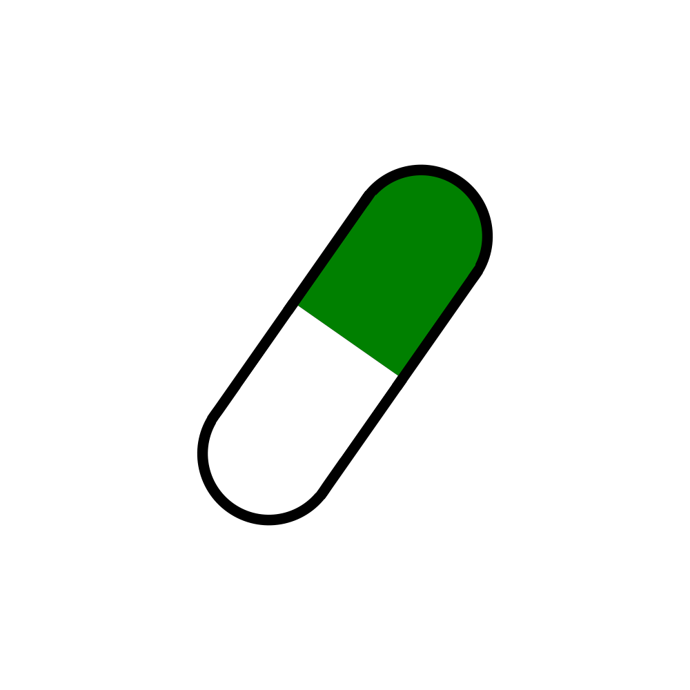

# Capsule

Create and share capsules with your loved one!

> You get a back rub tonight! :)
> 
> -Zach, written on 10/25/23

Imagine authoring many messages like this, stuffing them in tiny plastic capsules (like the green one below), and ceremonially pulling out a random one with your loved one every once in a while?

If that sounds like fun to you, please sign up with your partner [on the Vercel deployment](https://capsulepartner.vercel.app/register) (or launch your own NextJS instance however you please).

## What is this?

This is a highly stylized shared to-do/kanban board. It supports CRUD operations on capsules, which are basically "tasks".

Capsules, when shared with a "partner", are messages that are at first hidden from your partner except for their external colored shape.

There is a very minimal social network built into this application so that you can successfully connect with your partner once you both have accounts.

## Technical Notes

This project was a trial run of the NextJS app router and server actions. The ability to \*import\* a server action \*on the client\* is a great RPC abstraction that requires no networking whatsoever.

My [FastRPC](https://github.com/zsiegel92/fastRPC) project yields with something similar for Typescript->Python RPC, and I'm excited to think less about networking overall when possible.

 
 
 
 
 
